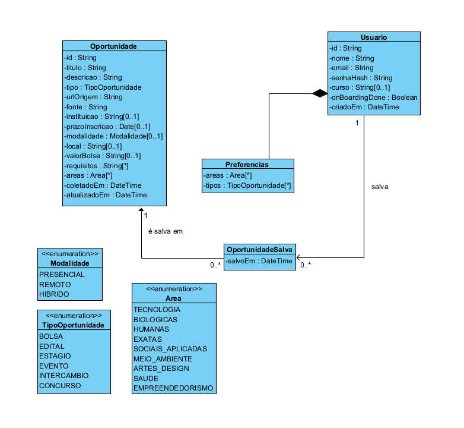

# Academic Pinpoint

Agregador de oportunidades acadêmicas (bolsas, editais, estágios, eventos) com
feed personalizado por áreas de interesse. Projeto Integrado 1 — UFES.

---

## Sumário

- [Estrutura do Monorepo](#estrutura-do-monorepo)
- [Diagrama de Classes](#diagrama-de-classes)
- [Ferramentas Escolhidas](#ferramentas-escolhidas)
- [Frameworks Reutilizados](#frameworks-reutilizados)
- [Geração de Documentação do Código](#geração-de-documentação-do-código)
- [Como Executar o Sistema](#como-executar-o-sistema)
- [Testes](#testes)

---

## Estrutura do Monorepo

| Diretório | Descrição |
|---|---|
| `apps/api` | Backend (NestJS + Prisma) |
| `apps/web` | Frontend (Next.js + Tailwind) |
| `apps/scraper` | Coletor de oportunidades (FastAPI) — planejado |
| `packages/shared` | Tipos e contratos compartilhados |

---

## Diagrama de Classes





### Resumo do Domínio

| Classe / Enum | Descrição |
|---|---|
| `Usuario` | Estudante cadastrado. Possui preferências (áreas e tipos) e pode salvar oportunidades. |
| `Oportunidade` | Bolsa, edital, estágio ou evento coletado de fontes externas. |
| `OportunidadeSalva` | Classe de associação N:M entre Usuário e Oportunidade. |
| `Preferencias` | Value object embutido no Usuário — áreas e tipos escolhidos no onboarding. |
| `TipoOportunidade` | Enum: BOLSA, EDITAL, ESTÁGIO, EVENTO, INTERCÂMBIO, CONCURSO. |
| `Area` | Enum: TECNOLOGIA, BIOLÓGICAS, HUMANAS, EXATAS, SOCIAIS_APLICADAS, etc. |
| `Modalidade` | Enum: PRESENCIAL, REMOTO, HÍBRIDO. |


## Ferramentas Escolhidas

| Categoria | Ferramenta | Detalhes |
|---|---|---|
| **Controle de versão** | Git + GitHub | Repositório hospedado no GitHub |
| **Build / Monorepo** | Turborepo + pnpm | Orquestra build e dev das apps JS/TS; pnpm como gerenciador de pacotes |
| **Build (API)** | TypeScript Compiler (`tsc`) | Compila o código da API para JavaScript |
| **Build (Web)** | Next.js | Build otimizado com SSR/SSG |
| **Testes** | Jest + ts-jest | Testes unitários da API |
| **Issue Tracking** | GitHub Issues | Controle de tarefas e bugs via issues do repositório |
| **CI/CD** | GitHub Actions | Pipeline em `.github/workflows/ci.yml` — roda build, testes da API e smoke test do scraper |
| **Container** | Nenhum (decisão de projeto) | SQLite em dev elimina necessidade de Docker. |
| **Banco de Dados** | SQLite (dev) / Prisma ORM | Prisma gerencia migrations e seed. |
| **Linter / Formatação** | TypeScript strict mode | `strict: true` no `tsconfig.json` |

---

## Frameworks Reutilizados

### Backend

| Framework / Lib | Versao | Finalidade |
|---|---|---|
| **NestJS** | 11.x | Framework HTTP com injeção de dependência e módulos |
| **Prisma** | 6.x | ORM com migrations tipadas e client auto-gerado |
| **bcryptjs** | 2.x | Hashing de senhas |
| **@nestjs/jwt** | 11.x | Autenticacao via JSON Web Tokens |
| **class-validator / class-transformer** | 0.14 / 0.5 | Validação e transformação de DTOs |
| **RxJS** | 7.x | Programação reativa (dependência do NestJS) |

### Frontend 

| Framework / Lib | Versao | Finalidade |
|---|---|---|
| **Next.js** | 15.x | Framework React com SSR, roteamento e otimizações |
| **React** | 19.x | Biblioteca de UI |
| **Tailwind CSS** | 4.x | Estilização utilitária |

### Scraper 

| Framework / Lib | Versao | Finalidade |
|---|---|---|
| **FastAPI** | 0.115+ | Framework HTTP assíncrono em Python |
| **BeautifulSoup4** | 4.12+ | Parsing de HTML para scraping |
| **Playwright** | 1.49+ (opcional) | Scraping de páginas com renderização JavaScript |
| **httpx** | 0.28+ | Cliente HTTP assíncrono |
| **Pydantic** | 2.10+ | Validação de dados e schemas |

> **Nota:** O módulo de scraping (`apps/scraper`) ainda não foi implementado —
> está planejado para a entrega final. A tecnologia ainda não foi decidida com
> 100% de certeza, portanto a documentação pode sofrer alterações.

### Infra / Monorepo

| Ferramenta | Versao | Finalidade |
|---|---|---|
| **Turborepo** | 2.x | Orquestração de builds e tasks no monorepo |
| **pnpm** | 11.x | Gerenciador de pacotes com workspaces |

---

## Geração de Documentação do Código

O projeto usa **TypeDoc** para gerar documentação HTML a partir dos comentários
e tipos do código TypeScript.

### Instalação e uso

```bash
# Instalar TypeDoc (uma única vez)
pnpm add -D typedoc --filter @academic-pinpoint/api

# Gerar documentação da API
cd apps/api
pnpm exec typedoc src/main.ts --out docs

# Abrir no navegador
start docs/index.html   # Windows
# open docs/index.html  # macOS
# xdg-open docs/index.html  # Linux
```

Para o **scraper** (Python), pode-se usar o **pdoc**:

```bash
cd apps/scraper
pip install pdoc
pdoc app --output-dir docs
```

---

## Como Executar o Sistema

### Pré-requisitos

- **Node.js** 20+
- **pnpm** (`npm i -g pnpm`)
- **Python** 3.11+ (necessário apenas para o módulo de scraping — planejado)

### Passos

```bash
# 1. Clonar o repositório
git clone https://github.com/reetzRS/Academic-Pinpoint.git
cd Academic-Pinpoint

# 2. Instalar dependências
pnpm install

# 3. Configurar variáveis de ambiente
cp apps/api/.env.example apps/api/.env

# 4. Preparar o banco de dados (migrations + seed)
pnpm db:setup

# 5. Iniciar o projeto em modo de desenvolvimento
pnpm dev
```

O arquivo `.env.example` já traz valores prontos para desenvolvimento
(`DATABASE_URL` em SQLite, `PORT=3001`, `WEB_ORIGIN` e `JWT_SECRET` de dev),
então basta copiá-lo para `.env` sem precisar editar nada para rodar
localmente.

O comando `pnpm dev` sobe todas as aplicações do monorepo simultaneamente
via Turborepo. As portas padrão são:

| Serviço | Porta |
|---|---|
| Web (frontend) | 3000 |
| API (backend) | 3001 |
| Scraper (planejado) | 8000 |

Quando o módulo de scraping for implementado, ele exigirá um virtualenv
Python com as dependências instaladas separadamente:

```bash
cd apps/scraper
python -m venv .venv
source .venv/bin/activate   # Windows: .venv\Scripts\activate
pip install -r requirements.txt
uvicorn app.main:app --port 8000
```

### Usuários do seed

Para testar a aplicação (ou fazer uma demo), o `pnpm db:setup` cria dois
usuários:

| Papel | E-mail | Senha |
|---|---|---|
| Usuário comum | `aluno@ufes.br` | `senha123` |
| Administrador | `admin@ufes.br` | `admin123` |

O usuário administrador tem acesso à área de Gestão, onde é possível
cadastrar, editar e remover oportunidades.

---

## Testes

```bash
pnpm test
```

Roda os testes unitários da API (Jest).
